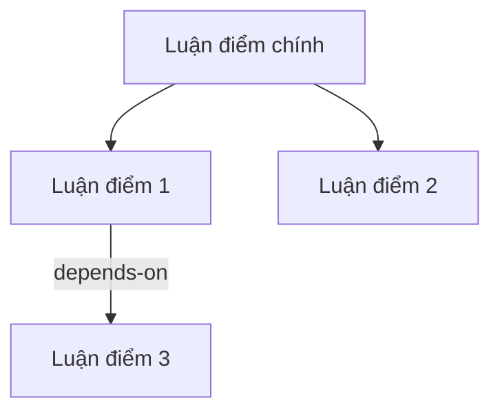

# Phase 1 — Structure (Hiểu cấu trúc sách)

## Mục tiêu

Trước khi trích xuất, phải hiểu **sách nói gì và nói như thế nào**.
Không có bước này, Phase 2 sẽ trích xuất盲目, miss cấu trúc logic.

## Bước 1.1 — Toàn cảnh (Survey)

Đọc lướt toàn bộ sách:
- Mục lục (TOC)
- Lời nói đầu / giới thiệu
- Kết luận / tóm tắt chương cuối
- Bất kỳ phần nào tác giả tóm tắt chính sách

**Output: TOC_MAP.md**

```markdown
# [Tên sách] — Bản đồ chương

## Thể loại
methodology / narrative / mixed / academic / ...

## Danh sách chương

| # | Chương | Mục đích | Mức quan trọng |
|---|--------|----------|----------------|
| 1 | [Tên] | [1 câu mô tả] | ★★★ / ★★ / ★ |
| 2 | [Tên] | [1 câu mô tả] | ★★★ / ★★ / ★ |
| ... | ... | ... | ... |

## Thứ tự đọc đề xuất
[Chương nào đọc trước, chương nào có thể skip]
```

## Bước 1.2 — Luận điểm xương sống (Backbone)

Đọc introduction + conclusion + opening mỗi chương.
Trả lời:

1. **Luận điểm chính của toàn sách** (1-3 câu)
2. **5-10 luận điểm cấp 2** (mỗi luận điểm = 1 chương hoặc 1 phần)
3. **Mối quan hệ giữa các luận điểm**:
   - `parallel`: Song song, cùng level
   - `sequential`: A → B → C (tuần tự)
   - `hierarchical`: A bao gồm B, C
   - `contrasting`: A đối lập B
4. **Dependency**: Luận điểm nào phụ thuộc luận điểm nào?

**Output: BACKBONE.md**

```markdown
# [Tên sách] — Xương sống luận điểm

## Luận điểm chính (1-3 câu)
[...]

## Luận điểm cấp 2

### 1. [Luận điểm 1]
- Thuộc chương: X
- Mối quan hệ: [parallel/sequential/...]
- Phụ thuộc: [luận điểm nào]

### 2. [Luận điểm 2]
...

## Dependency Graph

```

## Bước 1.3 — Bảng thuật ngữ (Seed Glossary)

Quét toàn bộ sách, tìm:
- Thuật ngữ xuất hiện ≥3 lần
- Thuật ngữ có định nghĩa riêng ("所谓 X, 是指...")
- Thuật ngữ là tên riêng của framework/concept
- Thuật ngữ看起来像常用词 nhưng tác giả dùng khác nghĩa

**Output: SEED_GLOSSARY.md**

```markdown
# [Tên sách] — Bảng thuật ngữ

| Thuật ngữ | Định nghĩa tác giả | Khác nghĩa thường | Xuất hiện lần đầu |
|-----------|--------------------|--------------------|-------------------|
| [term] | [author's def] | [what's different] | Chương X |
| ... | ... | ... | ... |
```

## Quality Gate Phase 1

Trước khi sang Phase 2, kiểm tra:

```
□ Backbone có thể hiện được cấu trúc logic của sách?
□ Mỗi chương có mô tả mục đích trong TOC_MAP?
□ Seed glossary có ≥5 thuật ngữ?
□ Thể loại sách đã xác định?
□ Đã xác định chương ★★★ (ưu tiên cao nhất)?
→ Nếu FAIL: đọc lại phần liên quan, bổ sung
→ Nếu PASS: sang Phase 2
```

## Lưu ý

- **Thể loại quyết định strategy**: 
  - Sách methodology → nhiều framework, principle (Phase 2 sẽ giàu)
  - Sách narrative → nhiều case study, ít framework (Phase 2 cần giữ故事)
  - Sách academic → nhiều data, research (Phase 2 cần giữ số liệu)
- **Chương ★★★ là ưu tiên**: Phase 2 nên chạy chương quan trọng trước
- **Seed glossary rất quan trọng**: Phase 2 sẽ dùng để consistent thuật ngữ
