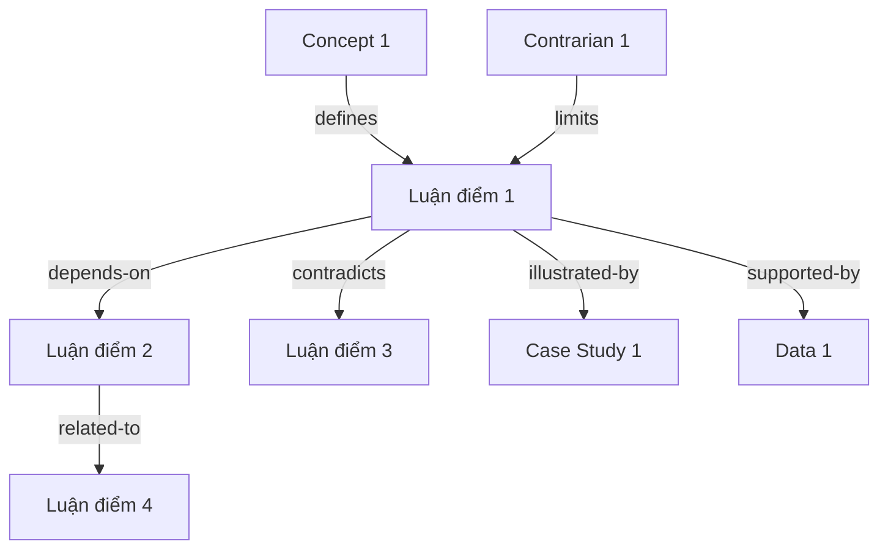
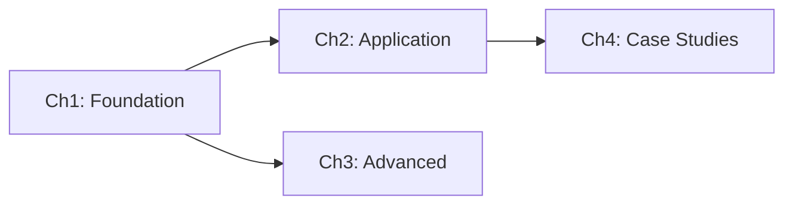

# Phase 4 — Encode (Cấu trúc hóa 4 tầng)

## Mục tiêu

Chuyển raw-extracts (đã qua validation) thành output 4 tầng, mỗi tầng phục vụ mục đích khác nhau.

## Triết lý: Layered Output

```
Tầng 1: Đọc 15 phút → Hiểu 50% sách (cho người bận rộn)
Tầng 2: Đọc 1 giờ   → Hiểu 75% sách (cho người muốn overview)
Tầng 3: Đọc 2-3 giờ → Hiểu 90% sách (cho người muốn chi tiết)
Tầng 4: Tra cứu     → Hiểu liên kết (cho người muốn deep dive)
```

User chọn tầng phù hợp với thời gian và nhu cầu.

## Tầng 1: Executive Summary (2-3 trang)

**Mục đích:** Đọc trong 15 phút, hiểu được sách nói gì, tại sao quan trọng.

### Template

```markdown
# [Tên sách] — Tóm tắt

## Thông tin
- **Tác giả:** ...
- **Năm:** ...
- **Thể loại:** methodology / narrative / mixed / academic
- **Số trang gốc:** ...
- **Đánh giá:** ★★★★☆ (4/5)

## Sách nói gì (1 đoạn, 3-5 câu)
[Tóm tắt主旨 chính, không chi tiết]

## Tại sao quan trọng
- [Điểm 1 khiến sách值得 đọc]
- [Điểm 2]
- [Điểm 3]

## 5 Key Takeaways
1. **[Takeaway 1]** — Chương X, trang Y
2. **[Takeaway 2]** — Chương X, trang Y
3. **[Takeaway 3]** — Chương X, trang Y
4. **[Takeaway 4]** — Chương X, trang Y
5. **[Takeaway 5]** — Chương X, trang Y

## Framework/Model chính (nếu có)
- [Tên framework]: [1 câu mô tả]

## Giới hạn của sách
- [Giới hạn 1]
- [Giới hạn 2]

## Ai nên đọc
- [Đối tượng 1] — vì [lý do]
- [Đối tượng 2] — vì [lý do]

## Ai không cần đọc
- [Đối tượng] — vì [lý do]
```

### Cách tạo

1. Đọc BACKBONE.md (Phase 1)
2. Chọn 5 takeaway quan trọng nhất từ tất cả extract
3. Viết "Sách nói gì" trong 3-5 câu
4. Trích giới hạn từ Contrarian extractor
5. Đánh giá sách (dựa trên: logic có chặt không? evidence có đủ không? có bias không?)

---

## Tầng 2: Chapter Summaries (10-15 trang)

**Mục đích:** Đọc trong 1 giờ, hiểu được mỗi chương nói gì, luận điểm chính, data chính.

### Template cho mỗi chương

```markdown
# Chương X: [Tên chương]

## Mục đích
[1-2 câu: chương này đóng vai trò gì trong tổng thể sách]

## Luận điểm chính
1. **[Luận điểm 1]**
   - Evidence: [tóm tắt bằng chứng]
   - Counter: [phản bác, nếu có]
2. **[Luận điểm 2]**
   - ...

## Data chính
- [Số liệu 1]: [ngữ cảnh]
- [Số liệu 2]: [ngữ cảnh]

## Case study chính
- **[Tên case]:** [1-2 câu tóm tắt] → Outcome: [kết quả]

## Concepts chính
- **[Concept 1]:** [định nghĩa ngắn]
- **[Concept 2]:** [định nghĩa ngắn]

## Giới hạn / Cảnh báo
- [Hạn chế mà tác giả提到]

## Liên kết
- Phụ thuộc: Chương Y (vì...)
- Liên quan: Chương Z (vì...)
- Contradicts: Chương W (nếu có)

## Mức quan trọng: ★★★
```

### Cách tạo

1. Đọc raw-extracts/chNN-extract.md
2. Tóm tắt mỗi section (arguments/data/stories/concepts/contrarian)
3. Giữ nguyên structure nhưng压缩语言
4. Đảm bảo mỗi chương có mục đích + liên kết

---

## Tầng 3: Detailed Extracts (20-30 trang)

**Mục đích:** Đọc khi cần chi tiết, giữ gần hết thông tin từ raw-extracts.

### Template

(Giống raw-extracts nhưng đã qua Phase 3 validation, đã được refine)

```markdown
# Chương X: [Tên chương] — Chi tiết

## Metadata
- Mức quan trọng: ★★★
- Liên quan: Chương Y, Chương Z
- Completeness: 95%

## Arguments
### arg-ch01-01: [Luận điểm]
- **Claim:** [...]
- **Evidence:** [...]
- **Counter:** [...]
- **Conditions:** [...]
- **Source:** "[Nguyên văn]" — trang Y

### arg-ch01-02: ...
...

## Data
### data-ch01-01: [Số liệu]
- **Value:** [...]
- **Context:** [...]
- **Source:** [Nghiên cứu, năm]
- **Quote:** "[Nguyên văn]" — trang Y

...

## Stories
### story-ch01-01: [Tên]
- **Who:** [...]
- **What:** [...]
- **Outcome:** [...]
- **Lesson:** [...]
- **Quote:** "[Nguyên văn]" — trang Y

...

## Concepts
### concept-ch01-01: [Thuật ngữ]
- **Definition:** [...]
- **Key distinction:** [Khác nghĩa thường?]
- **Related:** [...]
- **Quote:** "[Nguyên văn]" — trang Y

...

## Contrarian
### contra-ch01-01: [Phản bác]
- **Challenge:** [...]
- **Target:** [Chống lại luận điểm nào]
- **Evidence:** [...]
- **Implication:** [...]

...

## Cross-references
- → Chương Y: [mối liên hệ]
- → Chương Z: [mối liên hệ]
```

---

## Tầng 4: Knowledge Graph + Cross-Ref (5-10 trang)

**Mục đích:** Tra cứu liên kết, hiểu mối quan hệ giữa các concept/luận điểm.

### Knowledge Graph (Mermaid)



### Cross-references

```markdown
# Cross-References

## By Concept
| Concept | Xuất hiện ở | Liên quan |
|---------|-------------|-----------|
| [Concept 1] | Ch1, Ch3, Ch5 | Concept 2, Concept 3 |
| [Concept 2] | Ch2, Ch4 | Concept 1 |

## By Argument
| Argument | Counter | Supports |
|----------|---------|----------|
| [Arg 1] | [Counter 1] | [Data 1, Story 1] |
| [Arg 2] | [Counter 2] | [Data 2] |

## Contradictions
| A | B | Mâu thuẫn |
|---|---|-----------|
| [Arg 1 ở Ch1] | [Arg 3 ở Ch4] | [Mô tả mâu thuẫn] |

## Dependencies

```

---

## Output Structure

```
books/<slug>/
├── META.md
├── TIER-1-EXECUTIVE-SUMMARY.md
├── TIER-2-CHAPTER-SUMMARIES/
│   ├── 00-overview.md
│   ├── ch01-summary.md
│   ├── ch02-summary.md
│   └── ...
├── TIER-3-DETAILED-EXTRACTS/
│   ├── ch01-extract.md
│   ├── ch02-extract.md
│   └── ...
├── TIER-4-KNOWLEDGE-GRAPH/
│   ├── graph.md
│   ├── cross-references.md
│   └── contradictions.md
├── validation/
│   └── ...
└── raw-extracts/
    └── ...
```

## Quality Gate Phase 4

```
□ Tầng 1 (Executive Summary) có ≤3 trang?
□ Tầng 2 (Chapter Summaries) có đầy đủ chương ★★★?
□ Tầng 3 (Detailed Extracts) đã copy từ raw-extracts (đã validated)?
□ Tầng 4 (Knowledge Graph) có mermaid graph?
□ Cross-references có ≥1 edge mỗi node?
□ META.md đã được tạo?
→ Nếu FAIL: bổ sung phần thiếu
→ Nếu PASS: sang Phase 5
```
